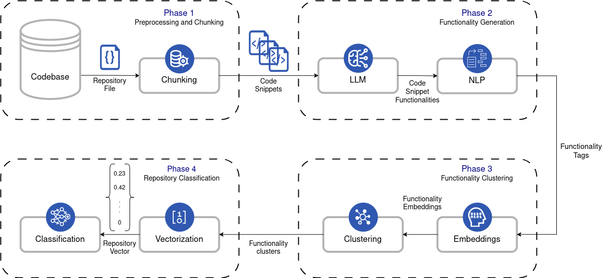

# Pipeline

This document describes the updated end-to-end pipeline of the **SAST-LLM** framework, following the current architecture used in the thesis.

## Overview

The pipeline is organized into four main phases:

1. **Preprocessing and Chunking**
2. **Functionality Generation**
3. **Functionality Clustering**
4. **Repository Classification**

At a high level, the system transforms a raw codebase into a repository-level behavioral representation, which is then used for classification.

```text
Codebase
  -> Phase 1: Preprocessing and Chunking
      -> Repository files
      -> Code snippets
  -> Phase 2: Functionality Generation
      -> LLM
      -> NLP
      -> Code snippet functionalities
  -> Phase 3: Functionality Clustering
      -> Embeddings
      -> Clustering
      -> Functionality clusters
  -> Phase 4: Repository Classification
      -> Vectorization
      -> Repository vector
      -> Classification
```

## Pipeline diagram

The updated pipeline diagram used in the thesis is shown below.



---

## Phase 1: Preprocessing and Chunking

### Objective

The goal of the first phase is to transform raw source code repositories into smaller, structured code snippets that can be processed by the later stages.

### Input

- a codebase containing multiple repositories
- source files belonging to benign or malicious repositories

### Processing steps

During this phase:

- repositories are traversed and their source files are collected
- each repository file is processed
- source code is divided into smaller code snippets

The chunking stage is responsible for converting large source files into manageable semantic units. These snippets form the basic processing unit for functionality extraction.

### Output

- repository files
- code snippets

---

## Phase 2: Functionality Generation

### Objective

The purpose of this phase is to convert each code snippet into a short natural-language description of its behavior or functionality.

### Processing steps

This phase consists of two main components:

#### 1. LLM

Each code snippet is passed to a Large Language Model, which analyzes the snippet and produces a functionality-oriented textual description.

The LLM is not used for final classification. Instead, it acts as a semantic transformation component that maps source code into an intermediate natural-language representation.

#### 2. NLP

After the LLM produces the initial snippet descriptions, an NLP processing stage refines them into a cleaner and more normalized form.

This step is responsible for producing the final functionality tags or functionality descriptions that will later be embedded and clustered.

### Output

- code snippet functionalities
- functionality tags

These outputs represent the behavioral meaning of the snippets in natural language.

---

## Phase 3: Functionality Clustering

### Objective

The goal of this phase is to group semantically similar functionalities into clusters, so that individual snippet descriptions can be mapped into a shared functionality space.

### Processing steps

This phase contains two major stages:

#### 1. Embeddings

The functionality descriptions produced in Phase 2 are transformed into dense vector representations.

These embeddings capture semantic similarity between snippet functionalities, making it possible to compare them in a continuous vector space.

#### 2. Clustering

The embedding vectors are clustered so that semantically related functionalities are grouped together.

Each functionality is therefore assigned to a functionality cluster, which represents a broader behavioral category.

### Output

- functionality embeddings
- functionality clusters

These clusters act as the shared semantic vocabulary of the system.

---

## Phase 4: Repository Classification

### Objective

The final phase classifies an entire repository based on the distribution of the functionality clusters identified in its snippets.

### Processing steps

This phase consists of two main steps:

#### 1. Vectorization

For each repository, the clustered snippet functionalities are aggregated into a repository-level vector.

This vector expresses the behavioral profile of the repository. In practice, it captures how strongly each functionality cluster is represented inside the repository.

#### 2. Classification

The repository vector is passed to a classifier, which predicts the repository class.

This is the final decision stage of the pipeline.

### Output

- repository vector
- repository classification

---

## End-to-end data flow

The overall data flow of the pipeline can be summarized as follows:

```text
Codebase
  -> Repository File
  -> Chunking
  -> Code Snippets
  -> LLM
  -> NLP
  -> Code Snippet Functionalities
  -> Embeddings
  -> Clustering
  -> Functionality Clusters
  -> Vectorization
  -> Repository Vector
  -> Classification
  -> Predicted Repository Class
```

---

## Conceptual role of each phase

| Phase | Role in the pipeline | Main output |
| --- | --- | --- |
| Phase 1 | transforms raw repositories into analyzable units | code snippets |
| Phase 2 | converts source code into semantic functionality descriptions | functionality tags / snippet functionalities |
| Phase 3 | groups semantically similar functionalities into shared behavioral categories | functionality clusters |
| Phase 4 | builds repository-level representations and predicts the final label | repository classification |

---

## Why this architecture is used

This pipeline is designed to move progressively from low-level code syntax to higher-level semantic behavior:

- **Phase 1** reduces raw code into structured units
- **Phase 2** extracts semantic meaning from each unit
- **Phase 3** organizes these meanings into a common clustering space
- **Phase 4** performs classification using repository-level behavioral fingerprints

This decomposition makes the framework more interpretable than directly classifying raw code alone, because the final repository decision is based on intermediate semantic functionality representations.

---

## Relation to the thesis methodology

Within the thesis, the pipeline supports the following methodological logic:

- source files are first decomposed into smaller snippets
- each snippet is translated into a functionality-level natural language representation
- these functionality representations are embedded and clustered into semantically meaningful groups
- each repository is represented through the distribution of its functionality clusters
- classification is performed on top of that repository-level representation

This means that the classifier does not operate directly on raw tokens or raw source code, but on a higher-level semantic abstraction of repository behavior.

---

## Practical execution order

A typical experimental run follows this order:

```bash
sastllm load
sastllm split
sastllm generate_functionalities
sastllm cluster --mode train
sastllm classify --mode train
sastllm cluster --mode test
sastllm classify --mode test
```

If batch-based functionality generation is used:

```bash
sastllm load
sastllm split
sastllm generate_functionalities_batch_api
sastllm cluster --mode train
sastllm classify --mode train
sastllm cluster --mode test
sastllm classify --mode test
```

---

## Summary

The SAST-LLM pipeline follows a four-phase architecture:

1. preprocessing and chunking
2. functionality generation
3. functionality clustering
4. repository classification

Its key idea is to represent repositories through clustered semantic functionality patterns rather than through raw code alone. This enables both structured analysis and repository-level classification based on behavioral abstractions.
